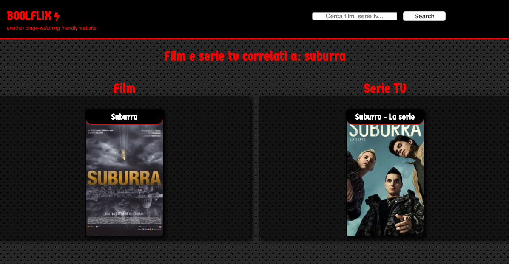
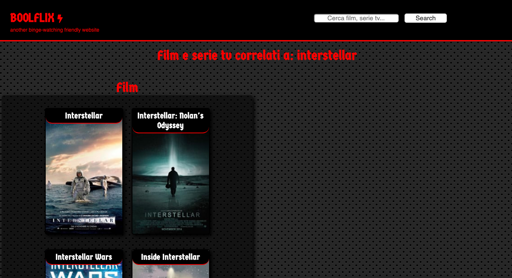
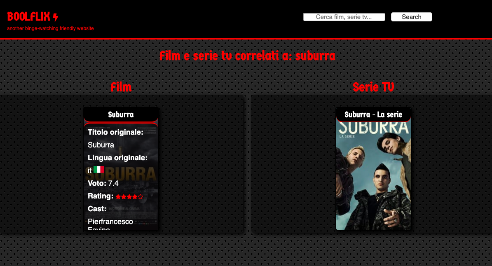
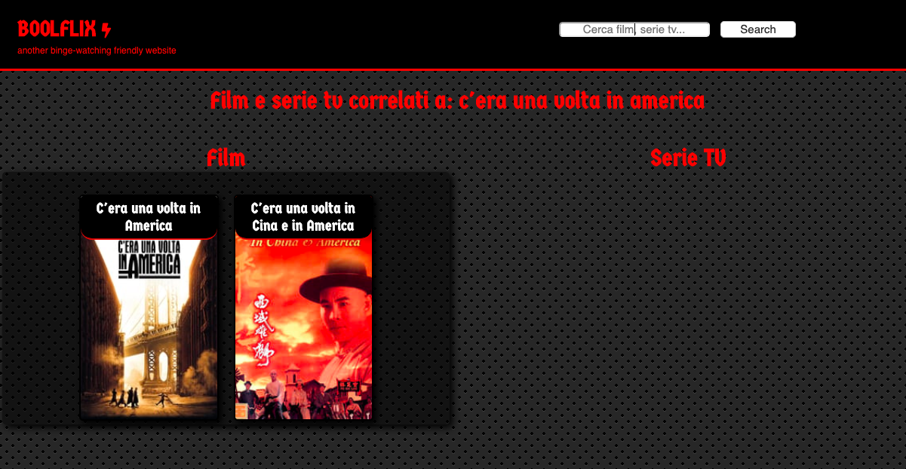

# htmlcssjs-boolflix

<h1>Boolflix: movies and tv series resarch </h1>

<h2>Goal:</h2> 

 Use <b>ajax call</b> and <b>API keys</b> ( https://www.themoviedb.org/?language=it-IT ) to build a movie and tv series search website that provides also cast informations, rankings and genre

<h2>Layout:</h2>

 Instead of copying Netflix's design I've realized a more pirate-streaming website layout, using some "hard attitude" fonts and colors

<h2>Research:</h2>

The website provides two different results columns if needed (if you are searching something that appears to be a movie AND a TV serie)
If the user search for something that belongs to only one category ( a movie OR a web serie) the website shows just one column

